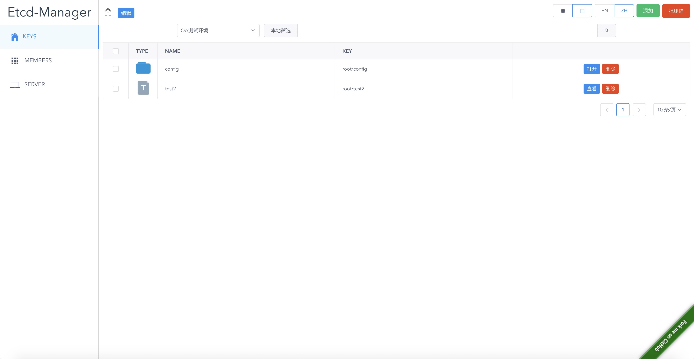
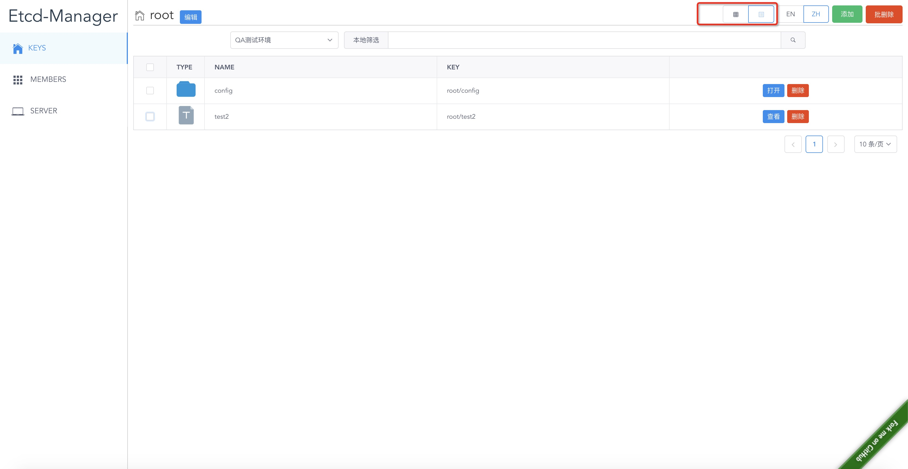
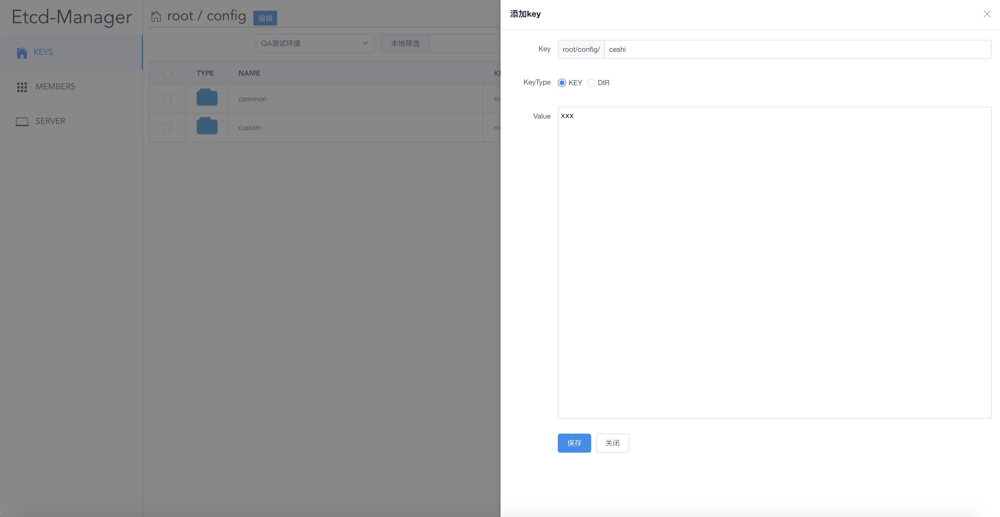
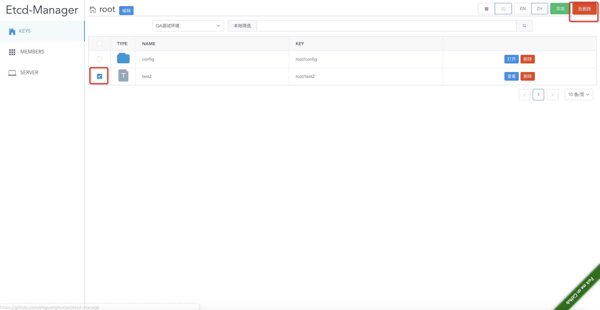
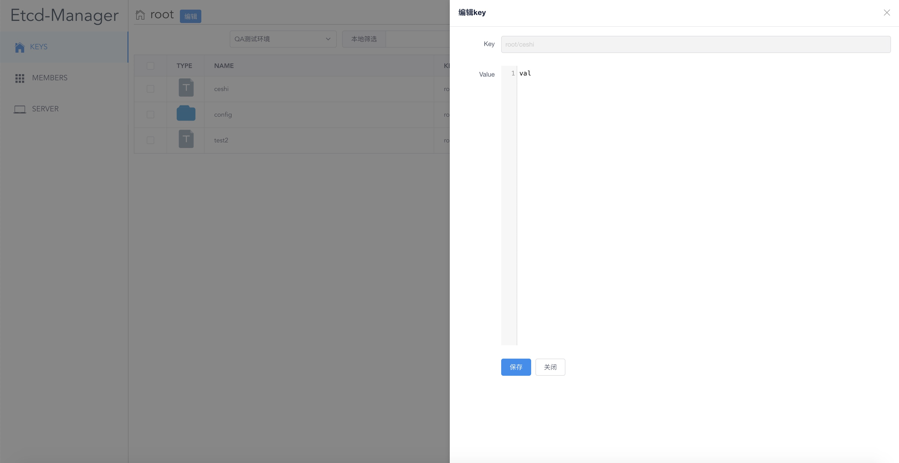

# etcd-manage

本项目是 [e3w](https://github.com/soyking/e3w) 的一个副本，修改了里边etcd库(etcd原来饮用地址不可以)的引入地址，和加了允许跨域请求。

可以使用我编写的docker-compose，快速在docker中启动etcd3管理界面 地址: [https://github.com/shiguanghuxian/docker-compose/tree/master/etcd33](https://github.com/shiguanghuxian/docker-compose/tree/master/etcd33)

## 编译和运行

由于前端使用了vue-cli3，在docker中没有成功编译前端代码，所以需要手动编译前端代码。

***前端代码编译：***

>
> 1. 安装node 
> 
> 		下载地址 [https://nodejs.org/](https://nodejs.org/)
>
> 2. 安装cnpm加速node依赖安装速度
>
> 		npm install -g cnpm  --registry=https://registry.npm.taobao.org
> 
> 3. 安装vue-cli3
> 
> 		cnpm install -g @vue/cli
> 
> 4. 安装依赖，编译项目
>
>  		cd $GOPATH/github.com/shiguanghuxian/etcd-manage/static
> 
> 		cnpm install && npm run build
> 

***运行***

项目中用到的go.etcd.io/etcd库，可以从github下载[https://github.com/etcd-io/etcd](https://github.com/etcd-io/etcd)，拷贝到对应目录

> 1. 安装go依赖
> 
> govendor add +external
> 
> 2. 运行
> docker-compose up
> 

## 运行效果
首页

列表形式显示

添加

删除

查看&修改

